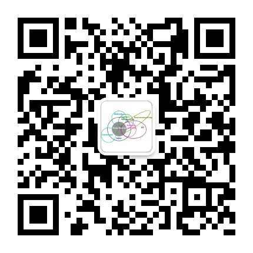

# 为MNIST数据集写的小工具
提供的功能主要有：
1. 下载MNIST数据集
2. 查看图片和标签
3. 提取图片
4. 生成自己的数据集
5. 数据集合并
#### 下载工具源码：
```bash
$ git clone https://github.com/messiLiao/mnist_helper.git
```
#### 下载数据集并解压
会在当前目录(mnist_helper)建立MNIST_data文件夹，并解压
```python
$ cd mnist_helper
$ python mnist_download_and_ungz.py
```
#### 查看数据集的图片或标签
查看训练集或者测试集中的图片:python mnist_helper.py show images-ubyte index。索引号从0开始
查看MNIST_data/t10k-images-idx3-ubyte 数据集当中的第1567张图片：
```bash
$ python mnist_helper.py show MNIST_data/t10k-images-idx3-ubyte 1567
this file is image file, image count is 10000, rows=28, cols=28
```
查看标签与查看图片方法相同，只需更改标签文件即可:python mnist_helper.py show labels-ubyte index
查看MNIST_data/t10k-labels-idx1-ubyte 数据集当中的第1567张图片的标签
```bash
$ python mnist_helper.py show MNIST_data/t10k-labels-idx1-ubyte 1567
this file is label file, label count is 10000
the 1567th label is 8
```

#### 提取图片
python mnist_helper.py extract 图片数据集文件名 [图片索引号]
如果不填索引号则默认提取所有图片，会解压到output_extract目录，并以序号命名
提取MNIST_data/t10k-images-idx3-ubyte数据集中所有的图片：
```bash
$ python mnist_helper.py extract MNIST_data/t10k-images-idx3-ubyte
extract 10000 images successfully
output directory is ./output_extract/
```
提取MNIST_data/t10k-images-idx3-ubyte数据集第89张图片：
```
$ python mnist_helper.py extract MNIST_data/t10k-images-idx3-ubyte 89
extract 1 images successfully
output directory is ./output_extract/
$ 
```
#### 将用户的数据生成MNIST数据格式
1. 新建一个文件夹user_data_dir
2. 新建以0-9为标签的10个文件夹
3. 把用户的数据放入对应的10个文件夹
4. 运行 python mnist_helper.py generate user_data_dir
5. 会在user_data_dir下面生成两个文件：user-images-ubyte 和 user-labels-ubyte
```bash
$ python mnist_helper.py generate user_data
user data generate successfully
output files: 
     user_data/user-images-ubyte
     user_data/user-labels-ubyte
```
#### MNIST数据文件合并功能
用户可以将不同的数据集文件进行合并, 最终生成一个文件output_merge_file-ubyte
```bash
$ python mnist_helper.py merge MNIST_data/t10k-labels-idx1-ubyte user_data/user-labels-ubyte
file merge successfully!, output file is  ./output_merge_file-ubyte
```

有问题添加公众号deeplearningset
